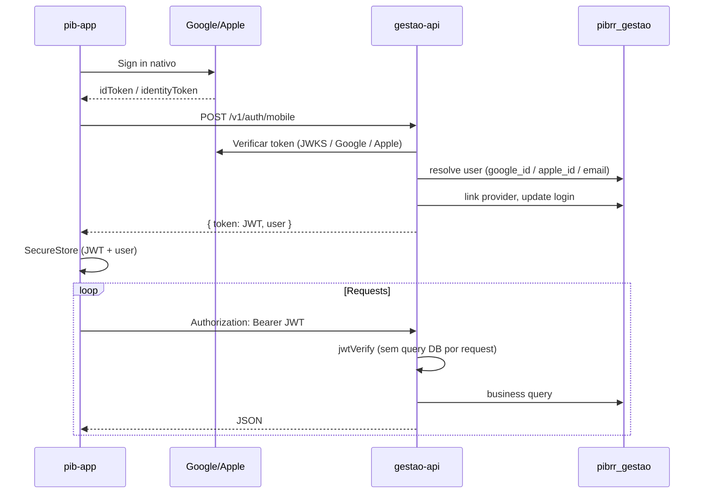

# 02 — System design

## Diagrama de contexto (C4 nível 1)

```text
                    ┌─────────────────────────────────────────┐
                    │           IdPs externos                 │
                    │  Google OAuth │ Apple │ Firebase (opt) │
                    └───────────────┬─────────────────────────┘
                                    │
    ┌──────────────┐    ┌───────────▼───────────┐    ┌──────────────┐
    │  pib-app     │    │     gestao-api        │    │ gestao-web   │
    │  (Expo/EAS)  │───►│  NestJS + Node 22     │◄───│ (Next futuro)│
    └──────────────┘    │  PM2 @ VPS :3060      │    └──────────────┘
                        │  nginx :443            │
    ┌──────────────┐    └───────────┬───────────┘
    │ www.pibrr.com│                │
    │ (só público) │                │ TCP localhost
    └──────────────┘                ▼
                        ┌───────────────────────┐
                        │ Postgres 16 :5433     │
                        │ database: pibrr_gestao│
                        └───────────────────────┘

    ┌──────────────┐    ┌───────────────────────┐
    │ feijoada.*   │───►│ caixa-api :3050       │──► caixa_db / pibrr_vendas
    │ vendas       │    │ (DOMÍNIO SEPARADO)    │
    └──────────────┘    └───────────────────────┘
```

## Diagrama de containers (nível 2)

```text
┌─────────────────────────────────────────────────────────────────┐
│ VPS srv871876 (31.97.169.130)                                   │
│                                                                 │
│  nginx :443                                                     │
│    ├── gestao-api.pibrr.com      → 127.0.0.1:3060              │
│    ├── caixa-api.zenvixlabs.app  → 127.0.0.1:3050              │
│    └── ...                                                      │
│                                                                 │
│  PM2                                                            │
│    ├── gestao-api (fork, 1 instância)                           │
│    └── caixa-api, school-backend, ...                           │
│                                                                 │
│  PostgreSQL 16 @ :5433                                          │
│    ├── pibrr_gestao  ← gestao-api (localhost)                   │
│    ├── pibrr_vendas  ← vendas (não tocar)                       │
│    └── caixa_db      ← PDV legado (não tocar)                   │
│                                                                 │
│  /root/.secrets/pibrr_gestao_database_url                       │
│  /opt/gestao-api/.env.production                                │
└─────────────────────────────────────────────────────────────────┘

┌──────────────────┐         ┌──────────────────┐
│ Vercel           │         │ EAS / App Stores │
│ pibrr (site)     │         │ pib-app          │
│ feijoada (vendas)│         │                  │
└──────────────────┘         └──────────────────┘
```

## Fluxo de autenticação — mobile



## Fluxo de autenticação — web (fase 2)

**Opção recomendada:** gestao-api emite cookie httpOnly após OAuth, ou gestao-web mantém NextAuth como BFF que chama `POST /v1/auth/web/exchange`.

```text
Browser → Google OAuth → gestao-api callback
       → Set-Cookie: session=...
       → gestao-web chama API com cookie
```

Durante transição, `pibrr` na Vercel pode continuar com NextAuth até cutover do painel.

## Camadas internas (gestao-api)

```text
src/
├── main.ts                # bootstrap NestJS
├── app.module.ts          # módulo raiz
├── config/                # env, logger
├── common/
│   ├── guards/            # JwtAuthGuard, RolesGuard
│   ├── decorators/        # @CurrentUser(), @RequirePermission()
│   ├── filters/           # HttpExceptionFilter
│   └── interceptors/      # logging, correlation id
├── modules/               # um módulo Nest por domínio
│   ├── auth/
│   ├── users/
│   ├── escalas/
│   └── ...
├── database/
│   ├── database.module.ts # pg Pool (localhost VPS)
│   └── migrations/        # SQL versionado
└── jobs/                  # cron interno ou scripts PM2
    └── push-dispatch.ts
```

### Regras de camada

| Camada | Pode | Não pode |
|--------|------|----------|
| `controllers` | Validar input (DTO/Zod), chamar service, mapear HTTP | SQL direto |
| `services` | Regras de negócio, transações | Conhecer `req`/`res` |
| `repositories` | SQL parametrizado | Regras de negócio |
| `guards` / `interceptors` | Auth, logging, correlation id | Lógica de domínio |

## Comunicação e contratos

| Aspecto | Padrão |
|---------|--------|
| Formato | JSON `application/json` |
| Versionamento | URL `/v1/...` |
| Erros | `{ "error": "mensagem" }` + HTTP status |
| Paginação | `?page=1&limit=20` onde aplicável |
| IDs | UUID v4 (strings) |
| Datas | ISO 8601 UTC no wire; datas “só dia” como `YYYY-MM-DD` |
| Upload | `multipart/form-data` → storage externo → URL no JSON |

## Conexão com banco

- **Em produção na VPS:** `DATABASE_URL` aponta para `127.0.0.1:5433/pibrr_gestao` (sem SSL interno).
- **Em desenvolvimento local:** tunnel SSH ou URL external com `sslmode=require`.
- **Pool:** `pg` com `max: 10` na API (processo long-lived PM2), diferente do serverless Vercel (`max: 1`).

## Observabilidade

| Item | Implementação |
|------|----------------|
| Logs | NestJS Logger (ou `nestjs-pino`) → stdout → PM2 → `/var/log/gestao-api/` |
| Health | `GET /health` (sem auth) — `{ status, db, version }` |
| Métricas | Fase 2 — Prometheus ou logs estruturados |
| Erros | Não vazar stack em produção; `X-Request-Id` |

## Segurança

- Bind `127.0.0.1` apenas; exposição só via nginx + TLS.
- CORS restrito: `https://www.pibrr.com`, `https://gestao.pibrr.com` (futuro), origins Expo.
- Rate limit em `/v1/auth/*`.
- Secrets só em `.env.production` na VPS e GitHub Secrets (nunca no repo).
- `pg_hba`: role `pibrr_gestao` só no DB `pibrr_gestao`.

## Escalabilidade

Fase 1: **1 instância PM2** é suficiente (~136 usuários, baixo tráfego).

Fase futura se necessário:

- PM2 cluster mode (cuidado com pool de conexões)
- PgBouncer na frente do Postgres
- Redis para rate limit / cache de sessão

## Decisão de stack

| Componente | Escolha | Motivo |
|------------|---------|--------|
| Runtime | Node.js **22 LTS** | Alinhado VPS (nvm), school-backend |
| Framework | **NestJS 11** | Módulos, DI, guards, alinhado a backends TypeScript enterprise |
| Linguagem | TypeScript strict | Paridade com pibrr/pib-app |
| DB driver | `pg` + pool | Processo long-lived na VPS; sem driver Neon HTTP |
| Validação | Zod | Schemas compartilháveis |
| Migrations | SQL em `db/migrations/` + runner Node | Schema já existe; sem Prisma obrigatório no início |
| Testes | Vitest + supertest | CI no GitHub Actions |
